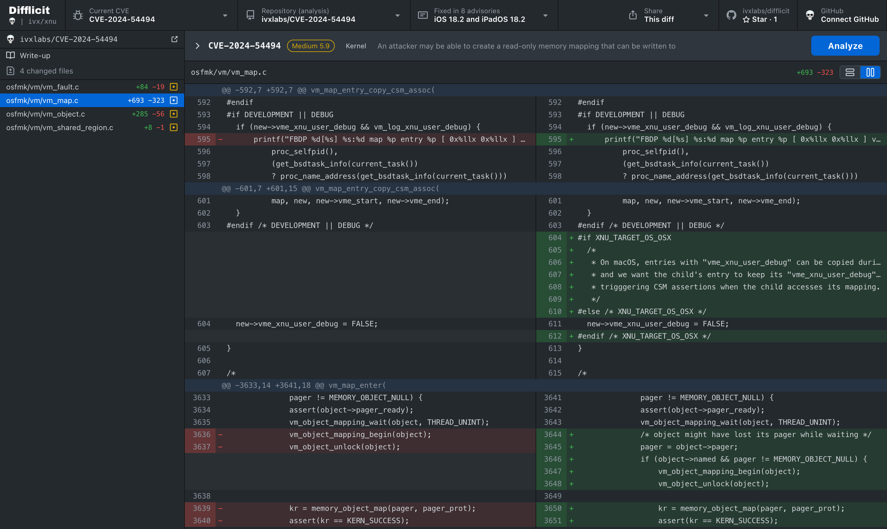
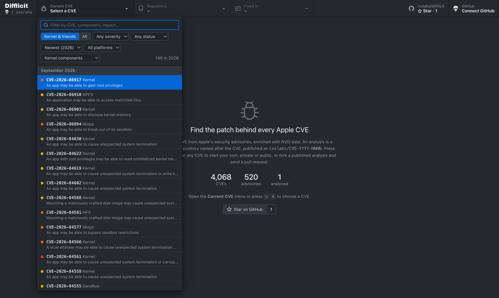
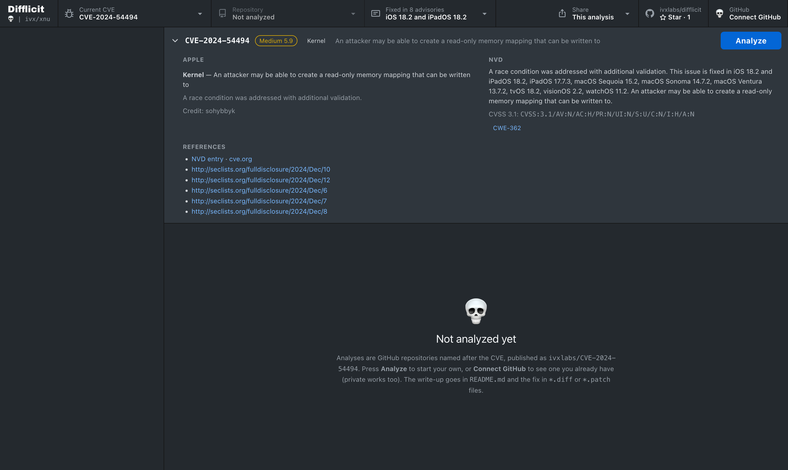

<div align="center">

# 💀 Difflicit

**Patch diffing and analysis for CVEs.**

Pick a CVE, read what the vendor and NVD say about it, and open the patch that fixed it<br>
in a diff viewer that feels like GitHub Desktop. Bring your own analyses, private ones included.

[](https://xnu.ivx.run)
[](LICENSE)
[](#-run-your-own-instance)
[](https://vite.dev)

[**Open ivx/xnu →**](https://xnu.ivx.run) · [How it works](#-how-it-works) · [Write an analysis](#-write-an-analysis) · [Run your own](#-run-your-own-instance)

<br>



<sub>The diff viewer, showing XNU's <code>osfmk/vm</code> changes between <code>xnu-11215.41.3</code> and <code>xnu-11215.61.5</code> as sample data.</sub>

</div>

---

**ivx/xnu** is the Difflicit instance this repository runs at [xnu.ivx.run](https://xnu.ivx.run): every CVE from
Apple's security advisories since 2020, enriched with NVD data, with a focus on XNU and its neighbours.

## ✨ What you get

- 🔎 **Every CVE at your fingertips.** Search by id, component or impact; filter by severity, platform, year and
  whether anyone has analyzed it yet. Press <kbd>⌘</kbd> <kbd>K</kbd> anywhere.
- 🧾 **Vendor and NVD side by side.** Apple's component, impact and credit next to the CVSS vector, CWE and
  references, and every advisory the fix shipped in.
- 🪓 **A real diff viewer.** Unified or split, line numbers, hunks, and files with tens of thousands of lines that
  scroll as smoothly as small ones: only the rows on screen are rendered.
- 🧪 **Analyses live in Git.** An analysis is just a GitHub repository named after the CVE, with a write-up in
  `README.md` and the fix in `*.diff` / `*.patch` files. Fork it, improve it, send a pull request.
- 🚀 **One button to start.** **Analyze** opens your repository for the CVE, or creates or forks one for you.
- 🔗 **Shareable to the line.** The URL always describes what's on screen: CVE, repository and file. Copy it,
  post it to X or LinkedIn, or **copy an embed code** to put the analysis right inside an article or blog post.
- 🪶 **Featherweight.** A static site with no server or database. The CVE data is sharded so the browser only
  downloads the slice you're looking at.

<table>
  <tr>
    <td width="50%"></td>
    <td width="50%"></td>
  </tr>
  <tr>
    <td align="center"><sub>Find a CVE: filters, scopes, and a year or component per download.</sub></td>
    <td align="center"><sub>What Apple and NVD say, every advisory it shipped in, and <b>Analyze</b>.</sub></td>
  </tr>
</table>

## 🧭 How it works

```
 GitHub Actions (weekly)                              Your browser (Difflicit, on GitHub Pages)
 ───────────────────────                              ─────────────────────────────────────────
 scripts/main.py
   Apple advisories ─┐
   NVD feeds ────────┼─► static JSON ─► CDN (R2) ───► CVE list and details
   GitHub repo list ─┘                                 cdn.ivx.run/applesec/api

 GitHub repositories named CVE-YYYY-NNNN ────────────► write-ups and diffs
                                                        straight from GitHub
```

**CVE data.** Once a week the `scrape` workflow fetches Apple's advisories and the NVD feeds, writes a static JSON
API, and syncs it to an S3-compatible bucket. Only files whose content changed are uploaded. The API is sharded:

| File | Contents |
| --- | --- |
| `index.json` | Totals and the list of shards (a few KB, always revalidated) |
| `years/2026.json` | Summaries of every `CVE-2026-*`. Typing a CVE id loads its year |
| `components/kernel.json` | The same for one component, across all years |
| `cves/CVE-2026-12345.json` | NVD data and every advisory entry for one CVE |

**Analyses.** For each CVE, Difflicit looks on GitHub for:

- `<org>/CVE-…`, the published analysis (the org owns the repository the site is built from, e.g. `ivxlabs`);
- that repository's forks;
- once you're connected, every repository you can see that is named after the CVE, private ones included.

## 🔬 Write an analysis

1. Open a CVE and press **Analyze**. Difflicit signs you in if needed, then opens your repository for that CVE,
   or offers to **fork** the published analysis or **create** `you/CVE-YYYY-NNNN` (private or public).
2. Write up the root cause in `README.md`, and add the fix as one or more `*.diff` / `*.patch` files: `git diff`,
   `git format-patch` and `diff -u` output all work.
3. Push. Your analysis shows up in Difflicit straight away, under **Repository**.
4. Working from a fork? **Create pull request** sends it back. Once merged, everyone sees it.

## 🔐 GitHub access and privacy

How Difflicit reaches GitHub on your behalf is chosen when the site is built:

| | Bring your own token (default) | Sign In (e.g. xnu.ivx.run) |
| --- | --- | --- |
| How | Paste a GitHub personal access token | Sign in with an [ivx account](https://iam.ivx.run) (OAuth 2.1 + PKCE) |
| Where the GitHub token lives | Your browser's local storage, sent only to `api.github.com` | Encrypted at iam.ivx.run, which calls GitHub for you; the browser never sees it |
| Enabled by | Nothing, it's always there | The `SUPABASE_URL`, `SUPABASE_CLIENT_ID` and `IAM_URL` variables. Without them none of this code is built |

Anonymous visitors can read every public analysis; GitHub limits them to 60 API requests an hour.

README HTML from analysis repositories is sanitized before it is shown, and a Content Security Policy restricts
where the page can load scripts from and send data to.

## 🛠 Run your own instance

Difflicit is generic: point it at your own data and repositories and it becomes your instance.

### Configure it

`difflicit.config.json` holds everything specific to an instance:

| Key | What |
| --- | --- |
| `name` | Shown under the Difflicit logo, in page titles and in shared posts, e.g. `ivx/xnu` |
| `icon` | Shown next to the name, e.g. `💀` |
| `apiBase` | Where the JSON API lives (overridden by the `API_BASE` repository variable) |
| `projectRepo` | The repository the Star button points at (CI uses the repository being built) |

### Develop locally

```sh
npm install
(cd scripts && uv run main.py --out ../public/api)   # add --limit 20 for a quick sample
VITE_API_BASE=/api npm run dev
```

- `ANALYSIS_ORG=<account>` makes the scrape mark CVEs as analyzed from another account's `CVE-*` repositories.
- To try Sign In locally, set `VITE_SUPABASE_URL`, `VITE_SUPABASE_CLIENT_ID` and `VITE_IAM_URL` (e.g. in
  `.env.local`) and add `http://localhost:5173` to iam's `GITHUB_ORIGINS`. The build prints whether Sign In is on.

### Deploy it

**1. The site, on GitHub Pages.** *Settings → Pages → Source: GitHub Actions*, plus a custom domain if you like.
`.github/workflows/pages.yml` builds and deploys on every push to `main`.

**2. The data, on Cloudflare R2** (any S3-compatible storage works):

1. Create a bucket, connect a custom domain (e.g. `cdn.ivx.run`), and add a CORS rule allowing `GET` from your site.
2. Create an R2 API token with *Object Read & Write* on the bucket.
3. Add these to the repository (*Settings → Secrets and variables → Actions*; either tab works):

   | Name | Value |
   | --- | --- |
   | `S3_ENDPOINT` | `https://<account-id>.r2.cloudflarestorage.com` |
   | `S3_BUCKET` | The bucket name |
   | `S3_ACCESS_KEY_ID`, `S3_SECRET_ACCESS_KEY` | From the R2 API token (as **secrets**) |
   | `S3_PREFIX` | Optional, defaults to `applesec/api` |
   | `API_BASE` | Optional, defaults to `apiBase` from the config file |

4. Run the `scrape` workflow once by hand. After that it runs weekly; run it again after publishing a new analysis
   to refresh the "analyzed" flags (a CVE's own page always checks GitHub live).

**3. Sign In** (optional, needs an [iam.ivx.run](https://iam.ivx.run) deployment):

1. In Supabase, *Authentication → OAuth Server → Clients*: add a **public** client with redirect URI
   `https://<your site>/`.
2. In iam's `wrangler.jsonc`, add the client id to `GITHUB_CLIENTS` and your site to `GITHUB_ORIGINS`.
3. Set `SUPABASE_URL`, `SUPABASE_CLIENT_ID` and `IAM_URL` in this repository and rebuild.

Users then allow GitHub access once, from their ivx account page.

## 📄 License

Difflicit is licensed under the [GNU General Public License, version 3 only](LICENSE) (`GPL-3.0-only`).

```
Difflicit: patch diffing and analysis for CVEs
Copyright (C) 2026 ivx research (Vikrant Singh Chauhan)

This program is free software: you can redistribute it and/or modify it under the terms of the
GNU General Public License as published by the Free Software Foundation, version 3.

This program is distributed in the hope that it will be useful, but WITHOUT ANY WARRANTY; without
even the implied warranty of MERCHANTABILITY or FITNESS FOR A PARTICULAR PURPOSE. See the GNU
General Public License for more details.
```

<div align="center"><sub>Made with 💀 by <a href="https://github.com/ivxlabs">ivxlabs</a></sub></div>
